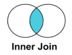

INNER JOIN => Quando quero selecionar registros que existem tanto em uma tabela A quanto uma tabela B. Por exemplo, na tabela Projetos 
e na tabela Tarefas, o INNER JOIN só exibiria os Projetos que tem Tarefas e Tarefas que tem Projetos. Então se um Projeto não tivesse nenhuma Tarefa relacionada, não seria exibido.

LEFT JOIN => Todos os registros de uma tabela A e seus correspondentes na tabela B, caso a tabela A seja a da esquerda. Por exemplo, 
na tabela Projetos e na tabela Tarefas, o LEFT JOIN exibiria todos os Projetos e suas Tarefas relacionadas, em um contexto onde 
Projetos está a esquerda. Caso algum Projeto não tenha alguma Tarefa relacionada, ainda assim seria exibido mas com a Tarefa assumindo 
um valor NULL.

RIGHT JOIN => O oposto do LEFT JOIN. Somente os registros correspondentes de uma tabela A a uma tabela B e todos os registros da tabela 
B, caso a tabela B esteja à direita. Seguindo com mais um exemplo, todas as Tarefas seriam exibidas e seus Projetos relacionados, mas 
nesse caso específico onde as Tarefas dependem dos Projetos, não haveria campos com NULL como no LEFT JOIN. Seria uma exibição 
semelhante ao INNER JOIN.

OUTER JOIN => Nas minhas pesquisas achei como FULL OUTER JOIN. Exibiria todos os registros tanto de uma tabela A quanto de uma tabela B.
Com o último exemplo, exibiria todos os Projetos e todas as Tarefas, sendo que os Projetos que não tem Tarefas seriam exibidos 
acompanhados de um NULL. Nesse caso, semelhante a exibição do LEFT JOIN.

Fonte das imagens: https://www.youtube.com/watch?v=4JLkHtIxXlA